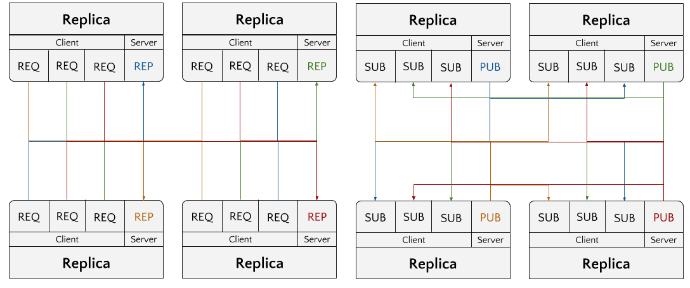
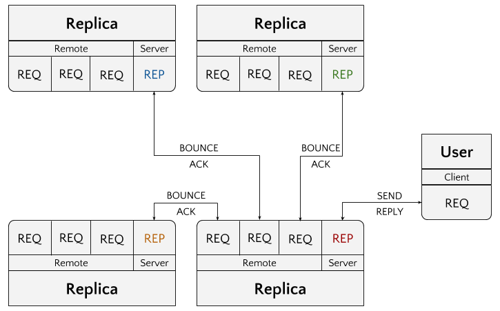

# ZMQ Net

**Tests for a fully connected ZMQ topology**



Trying to figure out all the patterns for REQ/REP/ROUTER,DEALER, etc. in order to get a fully connected network topology where all replicas respond to all other replicas and can make a request of any/all other replicas. My original idea was that I could create a REP on each node and a REQ for each other node (requiring full awareness of the topology). This would give us push based messaging. Alternatively perhaps we could create a PUB for each node and have all other replicas SUB to each other; more a push based messaging system.

Because Raft/HC requires RPC calls (e.g. request/response) - I went with the push based messaging model to begin with (the figure on the left).

## Current Status

Right now the network is the primary object. Each process creates a network object such that it has a `local` identification for the server process (REP) and `remotes` to connect to other process (REQ). When the network is run, it instantiates all of these connections.

At this point a `client` can send a message (REQ) to any of the processes in the network. When a client message is received (REP) it is broadcast (bounced) to all other processes in the network (REQ), who acknowledge receipt of the message. Once all processes have responded a REP is sent to the client.



<s>The current state of this network is not fault tolerant, ZMQ will block until all messages are received and sent. I need to implement request timeouts so
that any node that is down in the network does not block the client or server processes.</s> Currently, I've implemented [Lazy Pirate](http://zguide.zeromq.org/go:lpclient) with a request timeout and limited number of retries. The connection is just reset in a brute force way if there is no response from the server. If the server comes back online during retries then the message is handled.

This all seems to be working well, except in Broadcast (no retries). For some reason, I'm occasionally getting `<NONE>` for the `sock.Events` variable using `PollAll` and I'm not sure why.

It would be nice if there was a ROUTER/DEALER pattern with no in the middle broker ...

## Getting Started

To run the network code, first get and install the package:

    $ go get github.com/bbengfort/zmqnet/...

Then create a peers.json file to define the network as follows:

```json
{
  "info": {
    "num_replicas": 3,
    "updated": "2017-07-13T13:36:53.158Z"
  },
  "replicas": [
    {
      "pid": 1000,
      "name": "alpha",
      "address": "localhost:3264",
      "host": "apollo",
      "ipaddr": "127.0.0.1",
      "port": 3264
    },
    {
      "pid": 1001,
      "name": "bravo",
      "address": "localhost:3265",
      "host": "apollo",
      "ipaddr": "127.0.0.1",
      "port": 3265
    },
    {
      "pid": 1002,
      "name": "charlie",
      "address": "localhost:3266",
      "host": "apollo",
      "ipaddr": "127.0.0.1",
      "port": 3266
    }
  ]
}
```

You can save this file anywhere and either pass its location to the network or expose the path using the `$PEERS_PATH` environment variable.

In separate terminals, start each individual process by name:

    $ zmqnet -p peers.json serve -n alpha

    $ zmqnet -p peers.json serve -n bravo

    $ zmqnet -p peers.json serve -n charlie  


Then you can use the client in yet a fourth terminal to create messages for them to broadcast:

    $ zmqnet -p peers.json send -n bravo "this is a test message"

Both the `serve` and `send` commands require a specification of which host to use.
